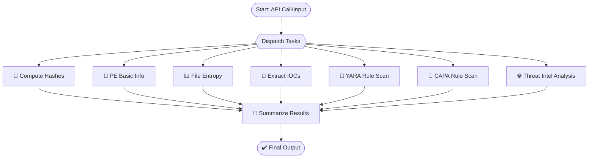

<p align="center">

</p>

# MalOps-Agent
Autonomous, Graph-Orchestrated Multi-Agent System for Malware Analysis and Threat Intelligence

# Structure

```
malops-agent/
├── agents/
│   ├── compute_hashes.py
│   ├── extract_pe_info.py
│   ├── file_entropy.py
│   ├── yara_scan.py
│   ├── capa_scan.py
│   ├── threat_intel.py
│   └── extract_iocs.py
├── graph/
│   ├── build_graph.py
│   └── state.py
├── api/
│   └── serve.py  # LangServe ou FastAPI wrapper
├── utils/
│   └── file_loader.py
├── tests/
│   └── test_agents.py
├── README.md
├── requirements.txt
└── pyproject.toml
```
# Mermaid


