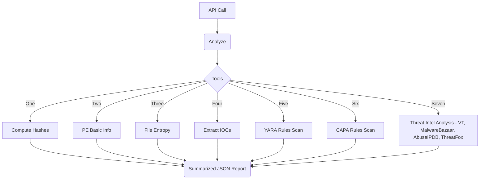

# MalOps Agent 

Agente de triagem de malware com Tools modulares e três modos de orquestração:

- **Single-Agent (graph.py)**: LLM com ToolNode decide as chamadas.
- **Multi-Agentes (multi_agents.py)**: StaticAnalysis → ThreatIntel → Supervisor.
- **Multi-node Paralelo (parallel_graph.py)**: nós independentes (hashes, PE, entropia, IOCs, YARA, CAPA, TI) convergem para o nó de resumo.

## Endpoints (FastAPI) — Hybrid only
- `POST /analyze/file-path` — single-agent (graph.py)
- `POST /analyze/upload` — single-agent via upload
- `POST /analyze` — grafo híbrido (multi-agente + paralelo)
- `POST /analyze/upload` — upload → grafo híbrido

## Diagrama (pedido do usuário)


## Streamlit UI

```bash
streamlit run ui/app.py
```

> UI: `streamlit run ui/app.py`

## Docker

Run the API (FastAPI + Uvicorn) and UI (Streamlit) with Docker Compose.

Build and start both services:

```
docker compose up --build
```

Endpoints:
- UI: `http://localhost:8501`
- API: `http://localhost:8000`

Notes:
- The API persists analyses to a named volume at `/data/analyses.db`.
- YARA and CAPA rules are mounted from `./rules` into the API container (read-only).
- Set API keys and options in `.env` (not baked into images); Compose passes them via `env_file`.
- Healthchecks: API exposes `GET /healthz`; UI health checks the root page.

Build images separately (optional):

```
# API image
docker build -f src/api/Dockerfile -t malops-api:local .

# UI image
docker build -f ui/Dockerfile -t malops-ui:local .
```
