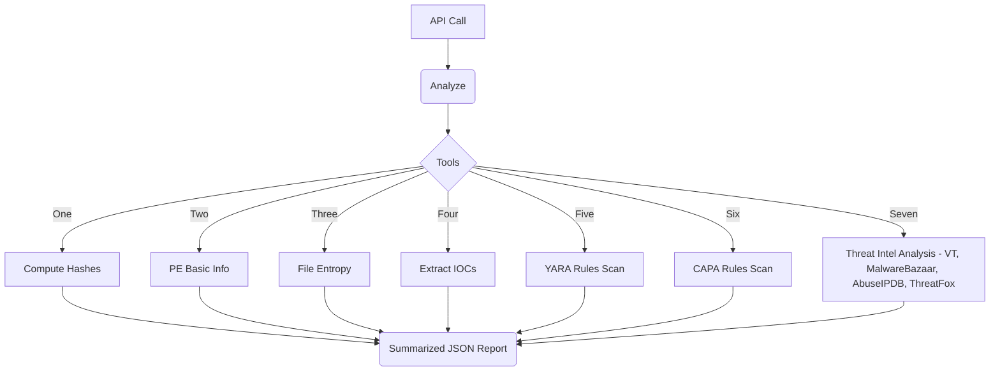

# MalOps Agent — v5 (Hybrid: Multi-Agente + Paralelo)


# MalOps Agent — v3 (LangGraph Single, Multi-Agents & Parallel Nodes)

Agente de triagem de malware com Tools modulares e três modos de orquestração:

- **Single-Agent (graph.py)**: LLM com ToolNode decide as chamadas.
- **Multi-Agentes (multi_agents.py)**: StaticAnalysis → ThreatIntel → Supervisor.
- **Multi-node Paralelo (parallel_graph.py)**: nós independentes (hashes, PE, entropia, IOCs, YARA, CAPA, TI) convergem para o nó de resumo.

## Endpoints (FastAPI) — Hybrid only
- `POST /analyze/file-path` — single-agent (graph.py)
- `POST /analyze/upload` — single-agent via upload
- `POST /analyze` — grafo híbrido (multi-agente + paralelo)
- `POST /analyze/upload` — upload → grafo híbrido

## Diagrama (pedido do usuário)


## Streamlit UI

```bash
streamlit run ui/app.py
```

> UI: `streamlit run ui/app.py`
