<p align="center">

</p>

# MalOps-Agent
Autonomous, Graph-Orchestrated Multi-Agent System for Malware Analysis and Threat Intelligence

# Structure

```
malops-agent/
├── agents/
│   ├── compute_hashes.py
│   ├── extract_pe_info.py
│   ├── file_entropy.py
│   ├── yara_scan.py
│   ├── capa_scan.py
│   ├── threat_intel.py
│   └── extract_iocs.py
├── graph/
│   ├── build_graph.py
│   └── state.py
├── api/
│   └── serve.py  # LangServe ou FastAPI wrapper
├── utils/
│   └── file_loader.py
├── tests/
│   └── test_agents.py
├── README.md
├── requirements.txt
└── pyproject.toml
```
# Mermaid

```mermaid
graph TD
    Start([Start: API Call/Input]) --> Dispatcher{{Dispatch Tasks}}

    %% Parallel analysis tasks
    Dispatcher --> A1[🧮 Compute Hashes]
    Dispatcher --> A2[📄 PE Basic Info]
    Dispatcher --> A3[📊 File Entropy]
    Dispatcher --> A4[🔎 Extract IOCs]
    Dispatcher --> A5[🧬 YARA Rule Scan]
    Dispatcher --> A6[🧠 CAPA Rule Scan]
    Dispatcher --> A7[🌐 Threat Intel Analysis]

    %% All nodes join at summary
    A1 --> Summary[📝 Summarize Results]
    A2 --> Summary
    A3 --> Summary
    A4 --> Summary
    A5 --> Summary
    A6 --> Summary
    A7 --> Summary

    Summary --> End([✔️ Final Output])
```


