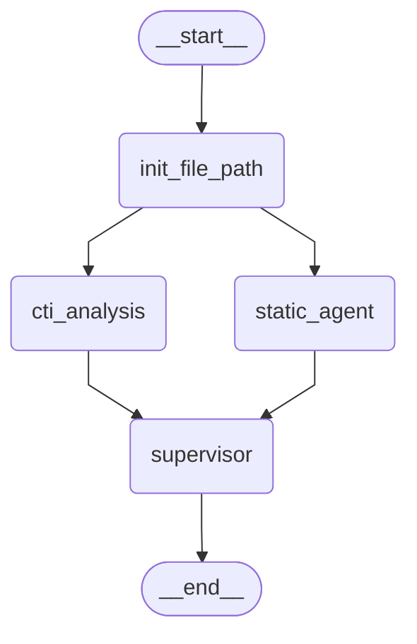

# Architecture

The system orchestrates multiple analysis steps and TI lookups in a graph. The final supervisor merges evidence and emits a structured JSON summary.

## Langchain Architecture

```mermaid
---
config:
  flowchart:
    curve: linear
---
graph TD;
	__start__([<p>__start__</p>]):::first
	init_file_path(init_file_path)
	static_agent(static_agent)
	cti_analysis(cti_analysis)
	supervisor(supervisor)
	__end__([<p>__end__</p>]):::last
	__start__ --> init_file_path;
	cti_analysis --> supervisor;
	init_file_path --> cti_analysis;
	init_file_path --> static_agent;
	static_agent --> supervisor;
	supervisor --> __end__;
```